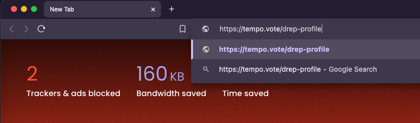
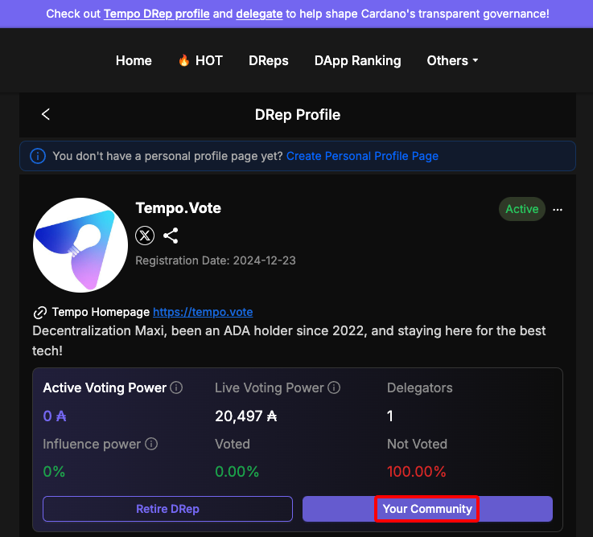
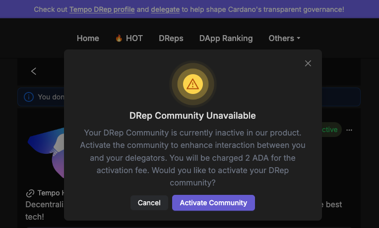
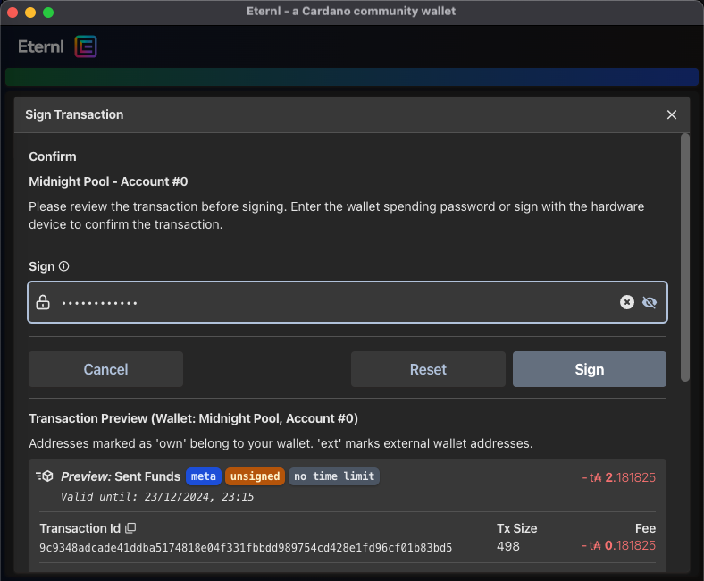
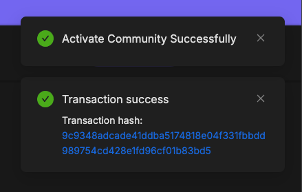

# Activate DRep Community



### <mark style="color:purple;">Step 1</mark>

Visit [https://tempo.vote/drep-profile](https://tempo.vote/drep-profile) on your browser or just click the URL bellow:



<figure><figcaption></figcaption></figure>


Make sure you have at least one cardano-wallet extension such as  **Eternl** or **Yoroi** installed.


Connect your wallet.



### <mark style="color:purple;">Step 2</mark>

Click on "<mark style="color:purple;">**Your Community**</mark>"

<figure><figcaption></figcaption></figure>

If you did not enable "<mark style="color:purple;">**DRep Community**</mark>" during the previous registration process, you will receive a notification panel asking if you want to activate "<mark style="color:purple;">**Activate Community**</mark>" as follows:

<figure><figcaption></figcaption></figure>

You will be charged an activation fee of 2 ADA for the <mark style="color:purple;">**DRep Community**</mark>, along with a small transaction fee.

<figure><figcaption></figcaption></figure>

Wait for the transaction to be confirmed. Once successfully activated, you will receive a notification as follows:

<figure><figcaption></figcaption></figure>


Now you're good to go with your <mark style="color:purple;">**DRep Community**</mark> :tada:




## Watch the video


