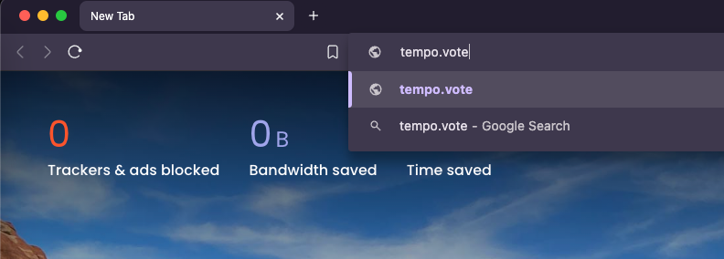
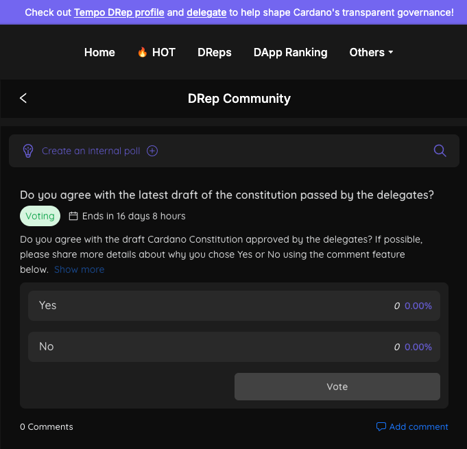
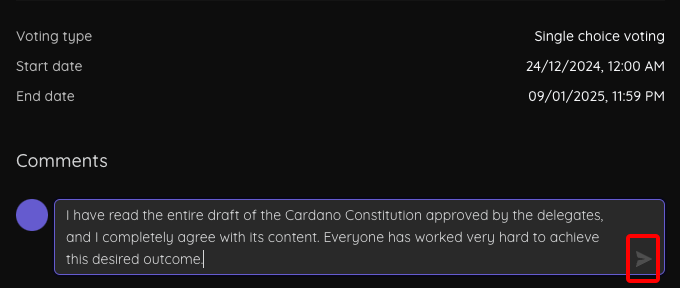
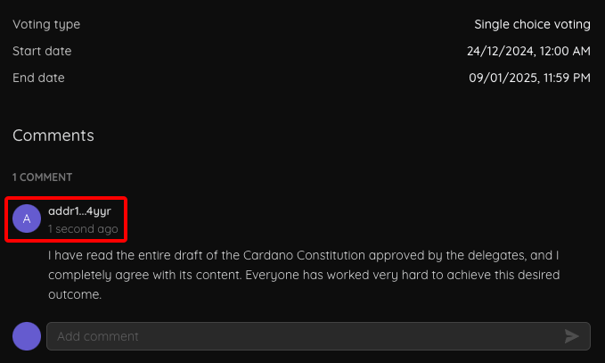

# Comment on an internal poll



### <mark style="color:purple;">Step 1</mark>

Visit [https://tempo.vote](https://tempo.vote/) on your browser or just click the URL bellow:



<figure><figcaption></figcaption></figure>


Make sure you have at least one cardano-wallet extension such as  **Eternl** or **Yoroi** installed.


Connect your wallet.



### <mark style="color:purple;">Step 2</mark>

View an internal poll details then click on "<mark style="color:blue;">Add comment</mark>":

<figure><figcaption></figcaption></figure>



### <mark style="color:purple;">Step 3</mark>

You will be redirected to the detailed page of the internal poll, where the cursor will stop at the input field. Enter your comment /and press "<mark style="color:green;">**Enter**</mark>" or click the  icon to submit:

<figure><figcaption></figcaption></figure>

<figure><figcaption></figcaption></figure>



## Watch the video



