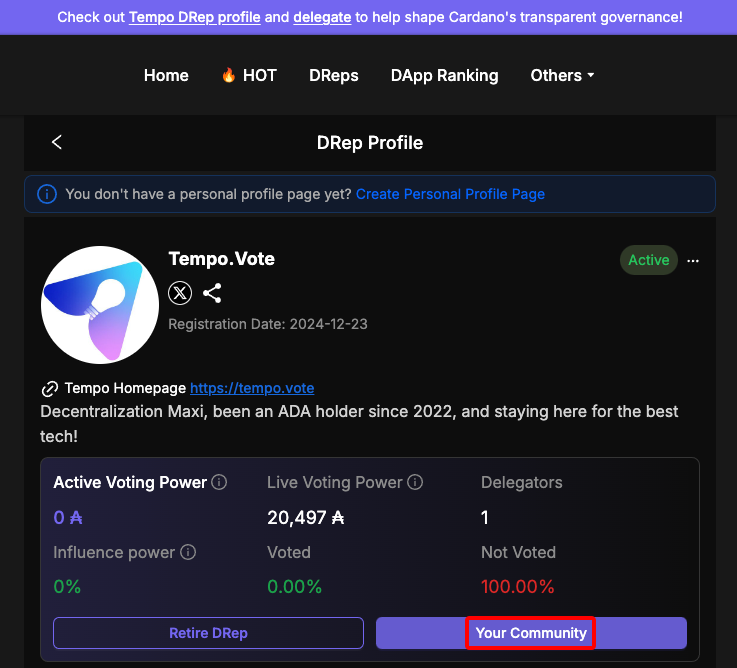

# Create an internal poll



### <mark style="color:purple;">Step 1</mark>

Visit [https://tempo.vote/drep-profile](https://tempo.vote/drep-profile) on your browser or just click the URL bellow:



<figure><figcaption></figcaption></figure>


Make sure you have at least one cardano-wallet extension such as  **Eternl** or **Yoroi** installed.


Connect your wallet.



### <mark style="color:purple;">Step 2</mark>

Click on "<mark style="color:purple;">**Your Community**</mark>"

<figure><figcaption></figcaption></figure>

If you did not enable "<mark style="color:purple;">**DRep Community**</mark>" during the previous registration process, You will need to activate this feature at "[**Activate Community**](activate-drep-community.md)". If you already have it, you will be redirected to the interface as shown below, then choose "<mark style="color:purple;">Create an internal poll</mark>":

<figure><figcaption></figcaption></figure>

You need to fill in the required fields marked with an \*, optionally add images if desired, and select the voting type/voting period. Once you are certain everything is complete and accurate, click the Publish button to finalize creating an internal poll within your DRep Community.

<figure><figcaption></figcaption></figure>

A dialog box will appear asking if you are sure you want to create the poll. After selecting "<mark style="color:purple;">Ok</mark>" you will receive a notification confirming the successful creation.

<figure><figcaption></figcaption></figure>

<figure><figcaption></figcaption></figure>



## Watch the video



