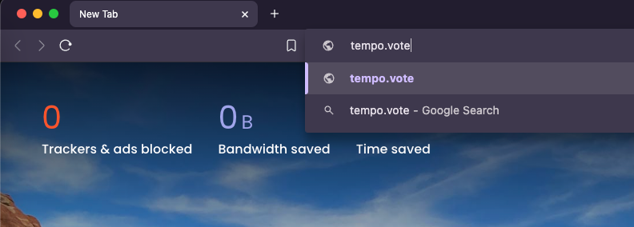

# DRep registration



### <mark style="color:purple;">Step 1</mark>

Visit [https://tempo.vote](https://tempo.vote/) on your browser or just click the URL bellow:



<figure><figcaption></figcaption></figure>


Make sure you have at least one cardano-wallet extension such as  **Eternl** or **Yoroi** installed.


Connect your wallet.



### <mark style="color:purple;">Step 2</mark>

Click "<mark style="color:purple;">**Register as a DRep**</mark>"

<figure><figcaption></figcaption></figure>

Fill in the required information


* **Required Information:** DRep name, agreement to store and manage data.
* **Optional Information:** Other details are optional but highly encouraged to be completed. Providing this information helps ADA holders better understand your goals, motivations, experience, and qualifications, making it easier for them to decide whether to delegate to you.
* **“Activate DRep Community”** button creates a space for DReps to engage with their delegators.




### <mark style="color:purple;">Step 3</mark>

Finally, click the "<mark style="color:purple;">**Register**</mark>" button and sign the transaction on-chain.

<figure><figcaption></figcaption></figure>

Sign the transaction.

<figure><figcaption></figcaption></figure>

You will receive a popup notification confirming successful DRep registration

<figure><figcaption></figcaption></figure>


* Your Your voting power will be **automatically** delegated to you and you can also receive voting power from other ADA holders.
* Now you're a DRep! 🎉




## Watch the video


