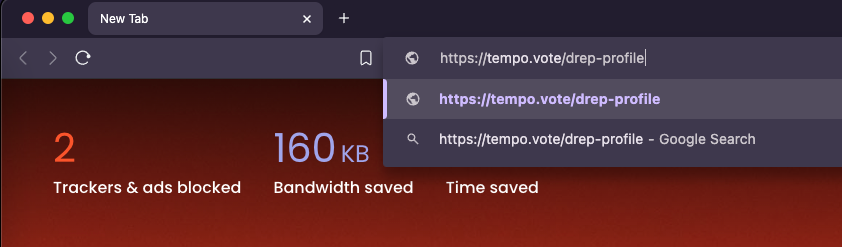
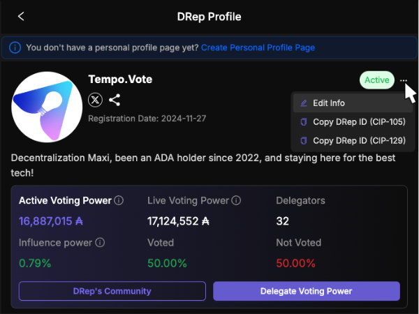
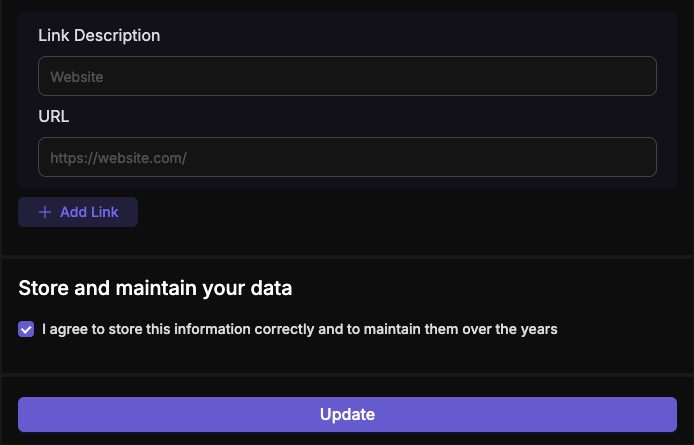
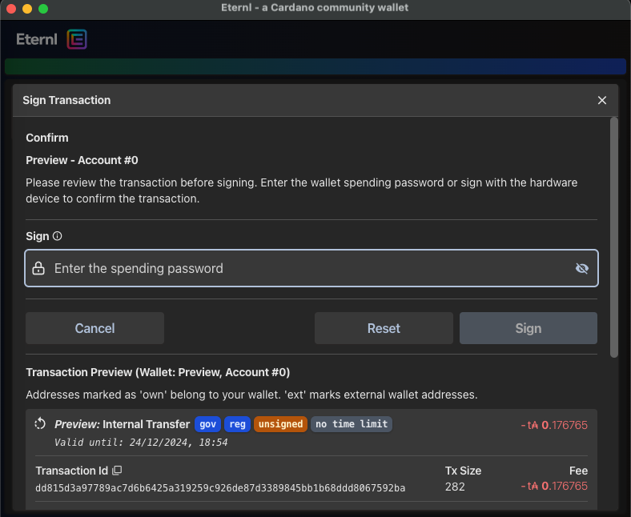

# DRep update



### <mark style="color:purple;">Step 1</mark>

Visit [https://tempo.vote/drep-profile](https://tempo.vote/drep-profile) on your browser or just click the URL bellow:



<figure><figcaption></figcaption></figure>


Make sure you have at least one cardano-wallet extension such as  **Eternl** or **Yoroi** installed.


Connect your wallet.



### <mark style="color:purple;">Step 2</mark>

Click on the three-dot icon next to the word "<mark style="color:green;">**Active**</mark>" then choose "Edit Info" then update the necessary information.

<figure><figcaption></figcaption></figure>



### Step 3

After that, click the "<mark style="color:purple;">**Update**</mark>" button and sign the transaction on-chain.

<figure><figcaption></figcaption></figure>

Sign the transaction.

<figure><figcaption></figcaption></figure>

You will receive a popup notification confirming update DRep info successfully:

<figure><figcaption></figcaption></figure>



## Watch the video



